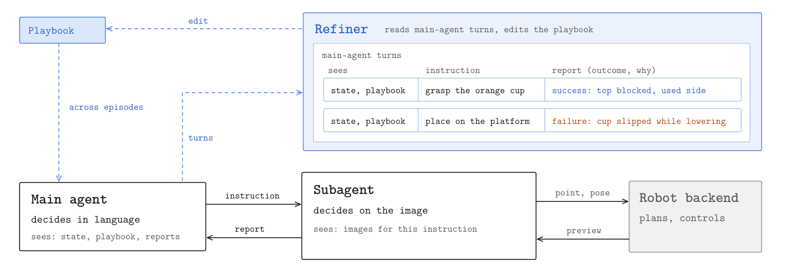

<div align="center">

<h1>RobotUse</h1>
<h3>Allocating Computation, Context, and Decisions</h3>

<p>
  <a href="https://junhoo.me/">Junhoo Lee</a><sup>1,*</sup> &middot;
  <a href="https://injun-baek.github.io/">Injun Baek</a><sup>2,*</sup> &middot;
  Seungyeon Kim<sup>2</sup> &middot;
  Suhyun Jeon<sup>2</sup><br>
  Minkyu Kim<sup>2</sup> &middot;
  Baekseung Kim<sup>2</sup> &middot;
  Nojun Kwak<sup>2</sup>
</p>

<p><sup>1</sup> KAIST &middot; <sup>2</sup> Seoul National University (SNU)</p>

<p><sup>*</sup> Equal contribution</p>

<p>
  <a href="https://arxiv.org/abs/2610.04929">
    <picture>
      <source media="(prefers-color-scheme: dark)" srcset="https://img.shields.io/badge/arXiv-2610.04929-red">
      
    </picture>
  </a>
  <a href="https://robotuse-team.github.io/"></a>
</p>

</div>


RobotUse lets language-model agents select visual targets, choose grasps, and
edit poses. Subagents keep local interaction histories and return outcomes to
the main agent; the backend handles geometry, motion planning, and control.

<p align="center"></p>

This release runs episodes in **native RoboLab**. See the
[project page](https://robotuse-team.github.io/) for demonstrations and results.

## Quick start

Use Linux x86_64 and an NVIDIA RTX GPU. Install Git LFS and uv, and review the
[system requirements and dependency licenses](SETUP.md) before setup.

```bash
git clone https://github.com/robotuse-team/RobotUse.git
cd RobotUse
scripts/setup/sources.sh
scripts/setup/sam2.sh
scripts/setup/cgn.sh
scripts/setup/robolab.sh
source scripts/lib/env.sh

# After accepting the Isaac Sim terms of use:
export OMNI_KIT_ACCEPT_EULA=Y
export ROBOT_LLM_PROVIDER=openrouter
export OPENROUTER_API_KEY='your-key'
export ROBOT_LLM_MODEL='your-provider-model-id'

scripts/run/robolab.sh --task BananaInBowlTask --seed 0 \
  --output-dir runs/example --dry-run
```

Remove `--dry-run` to run the episode, using a new output directory each time.
The default playbook is `v3`; select earlier versions with `--playbook-version`.
Use `scripts/run/robolab.sh --help` for options.

## Optional web UI

```bash
scripts/setup/cpu.sh
scripts/setup/ui.sh
scripts/run/ui.sh
```

Open [http://127.0.0.1:7860](http://127.0.0.1:7860), select a task and seed, then
run a configuration check or an episode. The UI shows live cameras, agent/tool
history, recordings, and the native verifier. It uses the provider credentials
from your launch environment.

## Code and outputs

- [Release layout](docs/public-release.md): core modules, optional components, and checks.
- [Setup details](SETUP.md): isolated environments, GPUs, checkpoints, and native checks.
- [Dependencies](DEPENDENCIES.md): pinned sources and upstream license terms.

Each episode saves logs, videos, configuration, and `verifier.json` in its output
directory. The native verifier determines task success; its subtask score is
reported separately from process status and reward. Runtime environments,
checkpoints, generated assets, and episode outputs stay outside Git.
